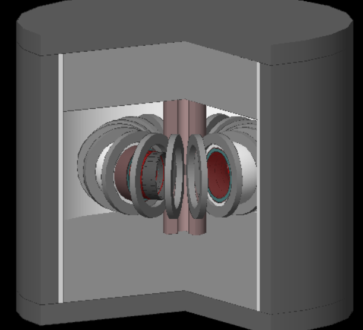

# **Neutron production and interaction in an ITER-like tokamak**

## Scientific background of the project

This program simulates, by using the software Geant4, the production of neutrons and the **Tritium breeding phenomenon** in a very simplified tokamak model inspired by ITER. <br />
As it is known, tritium is one of the two candidate fuels (together with deuterium) for future nuclear fusion reactors. However tritium is an incredibly rare isotope on Earth and the current most accepted proposal is to produce it inside fusion devices themselves by using the *breeding reaction* of neutrons with lithium: $`n+6Li`$ &rarr; $`T+\alpha`$. 

For this reason future fusion devices (like ITER) foresee the presence of a **breeding blanket** containing lithium compounds or molten salts from which the tritium will be extracted between the tokamak's operations.

ITER will use several **Test Breeding Modules** (TBM): small modules that will imitate a breeding blanket and will use different technologies to assess the best design for a real blanket. [Tritium Breeding ITER program](https://www.iter.org/mach/TritiumBreeding).

This project can simulate two simplified TBM technologies: **Water Cooled Lithium Lead** [WCLL](https://www.researchgate.net/publication/356863363_The_DEMO_Water-Cooled_Lead-Lithium_Breeding_Blanket_Design_Status_at_the_End_of_the_Pre-Conceptual_Design_Phase) and **Helium Cooled Pebble Bed** [HCPB](https://www.mdpi.com/1996-1073/16/14/5377).

## Purpose of this project

This project aims to obtain an estimate of the **Tritium Breeding Ratio** (TBR) using a breeding blanket inside a tokamak.
The TBR parameter is defined as the ratio between the number of tritium nuclei produced per neutron generated by nuclear fusion: <br />
$`TBR = \frac{T_{produced}}{n_{input}}`$ <br />

The simulation generates a certain number of neutrons (that can be changed in the `run.mac` file) and evaluates the neutrons interactions with the breeding blanket, counting the number of tritium nuclei generated. The results are printed in `outfile.txt`. <br />

The tokamak is designed as a series of toroidal and cylindrical volumes which simplify some of the layers and materials used in ITER.
The neutrons are produced by an annular source in the center of the tokamak and have an energy of 14.1 MeV (see `setup.mac` file). <br />

To study the breeding phenomenon two very simplified breeding blankets (WCLL, HCPB) inspired by the real ITER Test Breeding Modules (TBM) have been implemented in the `Construction.cc` file. <br />

Here is a rapid explanation of the files used:
- `main.cc`: file containing the int main() function which starts the simulation;
- `Construction.hh/cc`: implementation of the geometry of the simulation;
- `PhysicsList.hh/cc`: implementation of the physics of the simulation (EM, neutron reactions...);
- `NeutronHPphysics.hh/cc`: specific file for neutron physics, taken from the Geant4 example Hadr04;
- `PrimaryGeneratorAction.hh/cc`: definition of particles generation;
- `Detector.hh/cc`: define the "Sensitive Detector" (SD) of the simulation, in this case the tritium breeding blanket, which detects tritium generation events.

## Breeding Blanket

The breeding blanket is the most important part of this project since it's responsible for the tritium breeding. The two designs have been simplified in Geant4 as follows:
- WCLL: pure PbLi (Lithium Lead) with proportions 80% Pb, 20% Li;
- HCPB: the blanket is divided into three layers: one central Li4SiO4 layer sandwiched between two Beryllium neutron multipliers.

In both designs lithium can be enriched in 6Li by specifying it at runtime (see next section).



## Project specifications

This project has been built with the version **geant4-11-00-patch-03** (September 2022) and is designed to run on Linux; the project has been tested only on Ubuntu 22.04. <br />

To build the project on Linux with CMake:
```
source /path/to/geant4/install/4.11.1/bin/geant4.sh
cd /path/to/Geant4-Tokamak
mkdir build && cd build
cmake ..
make
```

To visualize the tokamak's structure the program can be simply launched with (a revolution angle of 270 degrees is set to see the tokamak's interior):
```
./Tokamak_Breeding.exe
```
(This mode requires **OpenGL**... see the [Geant4 installation guide](https://indico.cern.ch/event/676076/contributions/2767472/attachments/1551640/2437907/Geant4InstallationGuide.pdf)) <br />

The simulation can also be run without graphics and with the customizable run.mac file:
```
./Tokamak_Breeding.exe run.mac
```

In this mode multiple runs are allowed and the program will output the TBR evaluated on `outfile.txt`. <br />
The run.mac file must contain commands of the type: `/run/beamOn N` (N = number of neutrons generated). <br />

The user can also input two parameters: the **6Li enrichment** in the breeding blanket as a double precision number; the **blanket design** as a boolean (0 = HCPB, 1 = WCLL). Some example commands are:
```
./Tokamak_Breeding.exe run.mac 15.7 0
./Tokamak_Breeding.exe run.mac 100 1
./Tokamak_Breeding.exe run.mac 57.6 0
...
```

A gallery of images is available in order to see how the program works.

## Build with Docker

This project can be built also using Docker, which allows the user to avoid downloading and installing Geant4.

The chosen base image is [artemisbeta/geant4](https://hub.docker.com/r/artemisbeta/geant4) which features geant4-11 already installed.

To build the Docker image:
```
docker build -t tbr_geant4 .
```

and then to run it:
```
docker run -ti tbr_geant4
```

Inside the container the project can be built as previously mentioned:
```
source /usr/local/share/geant4/install/4.11.1/bin/geant4.sh
cd Geant4_Tokamak
mkdir build && cd build
cmake ..
make
```
The program can be executed as previously mentioned:
```
./Tokamak_Breeding.exe
./Tokamak_Breeding.exe run.mac
./Tokamak_Breeding.exe run.mac 15.7 0
...
```

## References
Mohammad Mehdi Nasseri, "Three Dimensional Simulation of ITER Machine by Using Geant4", Journal of Fusion Energy (2016). [Link to article](https://link.springer.com/article/10.1007/s10894-016-0083-0)
